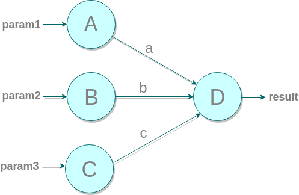

# flowed
[](https://github.com/daniel-duarte/flowed/blob/master/LICENSE)
[](https://www.npmjs.com/package/flowed)
[](https://travis-ci.org/daniel-duarte/flowed)
[](https://coveralls.io/github/daniel-duarte/flowed?branch=master)
[](https://sonarcloud.io/dashboard?id=daniel-duarte_flowed)

A fast and reliable flow manager and task runner for *Node.js*.

## Main Features

- [Parallel execution](#parallel-execution)
- [Dependency management](#dependency-management)
- [Asynchronous and synchronous tasks](#asynchronous-and-synchronous-tasks)
- [JSON based flow specifications](#json-based-flow-specifications)
- [Parametrized running](#parametrized-running)
- [Scoped visibility for tasks](#scoped-visibility-for-tasks)
- [Run flows from string, object, file or URL](#run-flows-from-string-object-file-or-url)
- [Pause/Resume and Stop/Reset functions](#pauseresume-and-stopreset-functions)
- [Library with reusable frequently used tasks](#library-with-reusable-frequently-used-tasks)


### Parallel execution

In order to run tasks in parallel, you don't have to do anything.
Simply adding them to a flow, they will run in parallel, of course if they don't have dependence on each other.


### Dependency management

Only specifying dependent inputs and outputs the flow manages dependencies automatically, executing in the correct order,
maximizing parallelism, and at the same time waiting for expected results when required.
Note that you can specify dependence between tasks arbitrarily, not only when one of them needs results from the other.


### Asynchronous and synchronous tasks

Each task in a flow is associated to a "resolver", which is the piece of code that runs when the task executes.
So, resolvers resolve the goals of tasks.
Well, those resolvers can be synchronous (simply returning its results) or asynchronous (returning a promise).
The flow will take care of promises, waiting for results according to dependencies. 


### JSON based flow specifications

The flow specifications are written in JSON format, which means:
- They are easily serialized/unserialized for storage and transmission.
- They are developer and IDE friendly, very easy to read and understand.
- They are easily or actually directly transformable from and to JavaScript objects.
- They are actually supported for most modern programming languages.
- They are API friendly.

Or in a few words, JSON specs means saving a lot of time and headaches.


### Parametrized running

The same flow can be ran many times with different parameters provided from outside.
Parameters can satisfy requirements for tasks that expect for them, in the same way they can be provided as
output of another task.
That also means, if you already have pre-calculated results, you can provide them to the flow and accelerate its execution.


### Scoped visibility for tasks

All tasks in a flow, even the ones that have the same resolver, have a private space of names for parameters and results.
That means:
- When developing a new resolver, the developer don't have take care of name collisions.
- Resolvers are always reusable between flows.

But, what happends with resourses that I want to share all through the flow?
Loggers, connections, application references, whatever.
In that case, you can use a "context" that's also available in all the flow tasks.
All resources in the contexts are shared.


### Run flows from string, object, file or URL

Flow can be ran from a specification provided from a JSON string, a JavaScript object,
a JSON file or an accessible URL that serves the spec in JSON.


### Pause/Resume and Stop/Reset functions

Flow executions can be paused and resumed with task granularity.
The same for stopping and resetting, that last being to set the flow up to start from the beginning. 


### Library with reusable frequently used tasks

For several common tasks, resolvers are provided in the bundle, so you don't have to worry about programming
the same thing over and over again.
You just have to take care of your custom code.


## Examples

- [Parallel Tasks](#parallel-tasks)
- [Dependent Tasks](#dependent-tasks)


### Parallel Tasks



```JavaScript
const flow = {
  tasks: {
    A: {
      provides: ['resultA'],
      resolver: {
        name: 'doNothing',
      },
    },
    B: {
      provides: ['resultB'],
      resolver: {
        name: 'doNothing',
      },
    },
    C: {
      requires: ['resultA', 'resultB'],
      resolver: {
        name: 'doNothing',
      },
    },
  },
}
```

```JavaScript
FlowManager.run(flow, {}, [], {
  doNothing: ResolverLibrary.NoopResolver,
});
```

### Dependent Tasks


```JavaScript
const flow = {
  tasks: {
    A: {
      provides: ['resultA'],
      resolver: {
        name: 'doNothing',
      },
    },
    B: {
      requires: ['resultA'],
      provides: ['resultB'],
      resolver: {
        name: 'doNothing',
      },
    },
    C: {
      requires: ['resultB'],
      resolver: {
        name: 'doNothing',
      },
    },
  },
}
```

```JavaScript
FlowManager.run(flow, {}, [], {
  doNothing: ResolverLibrary.NoopResolver,
});
```
