# Design your flow



@todo Fix diagram labels

# List your tasks

```
{
  tasks: {
    GetSessionInfo: {},
    GetGeoInfo: {},
    GetAuthorizedLocations: {},
    ValidateDistance: {},
    StoreEvent: {}
  }
}
```

# Specify dependencies

```
{
  tasks: {
    GetSessionInfo: {
      provides: ['ip', 'userId']
    },
    GetGeoInfo: {
      requires: ['ip'],
      provides: ['address']
    },
    GetAuthorizedLocations: {
      requires: ['userId'],
      provides: ['authorizedLocations']
    },
    ValidateDistance: {
      requires: ['address', 'authorizedLocations'],
      provides: ['isAuthorized']
    },
    StoreEvent: {
      provides: ['isAuthorized']
    }
  }
}
```

# Give code to run

```
{
  tasks: {
    GetSessionInfo: {
      provides: ['ip', 'userId'],
      resolver: { name: 'readSession' }
    },
    GetGeoInfo: {
      requires: ['ip'],
      provides: ['address'],
      resolver: { name: 'getGeo' }
    },
    GetAuthorizedLocations: {
      requires: ['userId'],
      provides: ['authorizedLocations'],
      resolver: { name: 'loadAuthLocations' }
    },
    ValidateDistance: {
      requires: ['address', 'authorizedLocations'],
      provides: ['isAuthorized'],
      resolver: { name: 'validateAccess' }
    },
    StoreEvent: {
      provides: ['isAuthorized'],
      resolver: { name: 'storeAccessEvent' }
    }
  }
}
```

Prepare the class mapping to run the flow:

```
{
  readSession: ReadUserSession,
  getGeo: GetGeoInformation,
  loadAuthLocations: LoadAuthLocations,
  validateAccess: ValidateLocationAccess,
  storeAccessEvent: StoreAccessEvent
}
```

Now it's time for you to do the developer job.
Implement the classes ReadUserSession, GetGeoInformation, LoadAuthLocations, ValidateLocationAccess and StoreAccessEvent with your business specific logic.

# Connect with outsite

To make this really useful, we need a way to connect with the outside of the flow.
Even when a flow can execute useful tasks without giving a explicit output (writing to databases, etc), it is very usual to require some direct output from the flow.

@todo Explain param 'results'

In a similar way, it is very important for flexibility and reusability purposes to provide some way of parametrization for the flows.

@todo Explain param 'params'
