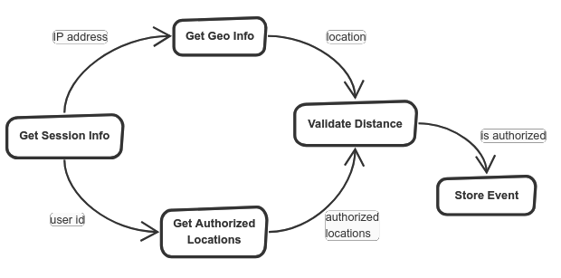

# Use Case

> A system needs to verify user locations to limit the access to certail features.
> Depending on the user location, she/he is authorized or not.


## Design your flow

The verification procedure would be:
- Get the current session information, where it is the basic user information and IP address.
- Call some API to obtain the Geo locaation information, from the IP.
- Request the database to get the authorized locations for the current user.
- Calculate the distance between the current location and the authorized user location, and check if it is close enough to be authorized.
- Finally, store the access event details in the database, for future access.





## List your tasks

Put any name to each task.

```JavaScript
{
  tasks: {
    GetSessionInfo: {},
    GetGeoInfo: {},
    GetAuthorizedLocations: {},
    ValidateDistance: {},
    StoreEvent: {}
  }
}
```


## Specify dependencies

Give every piece of data traveling to the flow a name.
- The `requires` clause give names to every required value that needs to be resolved before the task can be executed. The required values usually act as task parameters.
- The `provides` clause give names to every value that is supposed to be returned (provided) by the task. A task could not provide all promised values, and that would not be an incorrect flow. That could actually be used to control the flow, e.g. having conditional tasks that not always execute.

The same name in a `requires` or `provides` clauses mean the same value(s).


```JavaScript
{
  tasks: {
    GetSessionInfo: {
      requires: ['sessionId'],
      provides: ['ip', 'userId']
    },
    GetGeoInfo: {
      requires: ['ip'],
      provides: ['address']
    },
    GetAuthorizedLocations: {
      requires: ['userId'],
      provides: ['authorizedLocations']
    },
    ValidateDistance: {
      requires: ['address', 'authorizedLocations'],
      provides: ['isAuthorized']
    },
    StoreEvent: {
      provides: ['isAuthorized']
    }
  }
}
```


## Give code to run

Every task needs to have a "resolver" associated. The resolver is basically the code to be executed in order to fulfill whatever the task does.
So first of all, we'll just give a name for every resolver and then we'll see how to attach the real code.

```JavaScript
{
  tasks: {
    GetSessionInfo: {
      requires: ['sessionId'],
      provides: ['ip', 'userId'],
      resolver: { name: 'readSession' }
    },
    GetGeoInfo: {
      requires: ['ip'],
      provides: ['address'],
      resolver: { name: 'getGeo' }
    },
    GetAuthorizedLocations: {
      requires: ['userId'],
      provides: ['authorizedLocations'],
      resolver: { name: 'loadAuthLocations' }
    },
    ValidateDistance: {
      requires: ['address', 'authorizedLocations'],
      provides: ['isAuthorized'],
      resolver: { name: 'validateAccess' }
    },
    StoreEvent: {
      provides: ['isAuthorized'],
      resolver: { name: 'storeAccessEvent' }
    }
  }
}
```

At the time of the execution of the flow, we need to prepare a class mapping, giving every resolver name, its corresponding code.
This way we put a real class associated with every resolver, and therefore for each task.

```JavaScript
{
  readSession: ReadUserSession,
  getGeo: GetGeoInformation,
  loadAuthLocations: LoadAuthLocations,
  validateAccess: ValidateLocationAccess,
  storeAccessEvent: StoreAccessEvent
}
```

Note that this las JavaScript object is not directly JSON-izable, since its properties' values are class references and not simply strings.

Now it's time for you to do the developer job.
Implement the classes ReadUserSession, GetGeoInformation, LoadAuthLocations, ValidateLocationAccess and StoreAccessEvent with your business specific logic.
We'll come back to this later and see how to do it.
By the way, for common tasks there are some built-in resolvers provided in this package.


### Implementing a resolver

Let's implement the resolver `LoadAuthLocations`.

```JavaScript
class LoadAuthLocations {
  public exec() {
    // @todo Do something useful
  }
}
```

This simple class would be enough, although it obviously not too useful.
Suppose we have a `locationRepository` accessible for the class that provides the authorized locations for a user.
Our code would look something like this:

```JavaScript
class LoadAuthLocations {
  public exec() {
    const locations = locationRepository.getAuthoriedForUser(userId);
    return locations;
  }
}
```

If you are an attentive reader, you'll have noticed that `userId` is an undefined variable.
In order to give the task parameters from the flow, we need to add a `params` parameter to `exec`, that will hold all provided values (the task requirements listed in `requires`).

```JavaScript

import { GenericValueMap } from 'flowed';

// ...

class LoadAuthLocations {
  public exec(params: GenericValueMap) {
    const locations = locationRepository.getAuthoriedForUser(params.userId);
    return locations;
  }
}
```

Now take a look at the task "Get Session Info". It is supposed to provide two values, the `userId` and the `ip`.
How would we `return` two values?
Well, just like we did with the `params`, we actually return an object with the different results (a `GenericValueMap`).

Let's fix out class `LoadAuthLocations`:

```JavaScript
class LoadAuthLocations {
  public exec(params: GenericValueMap) {
    const locations = locationRepository.getAuthoriedForUser(params.userId);
    return { authorizedLocations: locations };
  }
}
```

Now our class is finished and ready to be used as a flow resolver.

But... what if we would need to retrieve the authorized locations for two different users in the same flow?
We would simply set the same resolver (`'loadAuthLocations'`) for both tasks:

```JavaScript
{
  tasks: {
    // ...
    GetAuthorizedLocations1: {
      requires: ['userId1'],
      provides: ['authorizedLocations2'],
      resolver: { name: 'loadAuthLocations' }
    },
    GetAuthorizedLocations2: {
      requires: ['userId2'],
      provides: ['authorizedLocations2'],
      resolver: { name: 'loadAuthLocations' }
    },
    // ...
  }
}
```

Everything look fine, but if you take a look at our `LoadAuthLocations`, you'll notice that it uses always `userId`.
So, how does the class know which user Id should use?

The simple solution is to configure the resolver with a a parameters map. That is, something that tells the flow:
- For `GetAuthorizedLocations1` use `userId1` as `userId`.
- For `GetAuthorizedLocations2` use `userId2` as `userId`.
So, inside the class, the user Id is always `userId`, but its value would be `userId1` for one task, and `userId2` for the other.

Exactly the same thing happens with the tasks results.
Even having `LoadAuthLocations` that always returns `authorizedLocations`, we need to create a mapping to return:
- `authorizedLocations1` from `loadAuthLocations1`.
- `authorizedLocations2` from `loadAuthLocations2`.

Applying the parameters mapping, those tasks would be:

```JavaScript
{
  tasks: {
    // ...
    GetAuthorizedLocations1: {
      requires: ['userId1'],
      provides: ['authorizedLocations2'],
      resolver: {
        name: 'loadAuthLocations',
        params: { userId : 'userId1' },
        results: { authorizedLocations: 'authorizedLocations1' },
      },
    },
    GetAuthorizedLocations2: {
      requires: ['userId2'],
      provides: ['authorizedLocations2'],
      resolver: {
        name: 'loadAuthLocations',
        params: { userId : 'userId2' },
        results: { authorizedLocations: 'authorizedLocations2' },
      },
    },
    // ...
  }
}
```

We've just instructed the flow, how to pass parameters to the resolvers, and how to get the results.

Ok, let's forget this hypothetical situations and fix our original flow to include the mappings.


```JavaScript
{
  tasks: {
    GetSessionInfo: {
      requires: ['sessionId'],
      provides: ['ip', 'userId'],
      resolver: {
        name: 'readSession',
        params: { sessionId: 'sessionId' },
        results: { ipAddress: 'ip', userId: 'userId' },
      }
    },
    GetGeoInfo: {
      requires: ['ip'],
      provides: ['address'],
      resolver: {
        name: 'getGeo',
        params: { ipAddress: ip },
        results: { geoAddress: 'address' },
      }
    },
    GetAuthorizedLocations: {
      requires: ['userId'],
      provides: ['authorizedLocations'],
      resolver: {
        name: 'loadAuthLocations',        
        params: { userId: 'userId' },
        results: { authorizedLocations: 'authorizedLocations' },
      }
    },
    ValidateDistance: {
      requires: ['address', 'authorizedLocations'],
      provides: ['isAuthorized'],
      resolver: {
        name: 'validateAccess',
        params: { geoAddress: 'address', locations: 'authorizedLocations' },
        results: { valid: 'isAuthorized' },
      }
    },
    StoreEvent: {
      provides: ['isAuthorized'],
      resolver: {
        name: 'storeAccessEvent',
        params: { isAuthorized: 'isAuthorized' },
        results: {},
      }
    }
  }
}
```

### Async tasks

In real world, database access, HTTP requests, file operations, etc. will not be ran synchronously.

So in our example class `LoadAuthLocations`, we wouldn't actually run that way.
Instead, you'd need to use the Flowed support for async tasks.
In order to support asynchronic tasks, Flowed takes advantage of `Promise`s.

And that's as easy as returning a Promise that resolves to the expected results.

Let's suppose our `locationRepository.getAuthoriedForUser` returns a Promise to make it asynchronous.

```JavaScript
class LoadAuthLocations {
  public async exec(params: GenericValueMap) {
    const locations = await locationRepository.getAuthoriedForUser(params.userId);
    return { authorizedLocations: locations };
  }
}
```

Note that we've added the `async` keyword to `exec`, and we've used the `await` syntax.
Also remember that all `async`  functions returns a Promise, even when it is not explicit.

According to each flow tasks' dependences, Flowed will run concurrently as many tasks as possible, letting the OS parallelize all the I/O opertions maximizing the performance and abstracting the programmer to manage the tasks dependences and concurrency.


## Connect with the outsite

To make this thing really useful, we need a way to connect with the outside of the flow.
Even when a flow can execute useful tasks without giving a explicit output (writing to databases, etc), it is very usual to get some direct output from the flow.

We can accomplish that simply giving an array of the expected results.
For example, in this case we want to know if the user is authorized, which is the edge 'isAuthorized' in the flow.
We will run the flow then, indicating that the expected results are `['isAuthorized']`.


In a similar way, it is very important for flexibility and reusability purposes to provide some way of parametrization for the flows.
Analyzing the flow in this example, we can easily see that no task is providing the `'sessionId'`. This is because it will be given from the outside, at the time of the execution.
That is, it is a flow parameter.
We provide parameters as a name-value mapping like this:

```JavaScript
{
  sessionId: '98113fcc-a9aa-444a-9241-3b7694142605',
}
```

Ok, we have almost all pieces to run a flow.


## Run

```JavaScript
FlowManager.run(
  // The flow spec
  {
    tasks: {
      GetSessionInfo: {
        requires: ['sessionId'],
        provides: ['ip', 'userId'],
        resolver: {
          name: 'readSession',
          params: { sessionId: 'sessionId' },
          results: { ipAddress: 'ip', userId: 'userId' },
        },
      },
      GetGeoInfo: {
        requires: ['ip'],
        provides: ['address'],
        resolver: {
          name: 'getGeo',
          params: { ipAddress: ip },
          results: { geoAddress: 'address' },
        },
      },
      GetAuthorizedLocations: {
        requires: ['userId'],
        provides: ['authorizedLocations'],
        resolver: {
          name: 'loadAuthLocations',        
          params: { userId: 'userId' },
          results: { authorizedLocations: 'authorizedLocations' },
        },
      },
      ValidateDistance: {
        requires: ['address', 'authorizedLocations'],
        provides: ['isAuthorized'],
        resolver: {
          name: 'validateAccess',
          params: { geoAddress: 'address', locations: 'authorizedLocations' },
          results: { valid: 'isAuthorized' },
        },
      },
      StoreEvent: {
        provides: ['isAuthorized'],
        resolver: {
          name: 'storeAccessEvent',
          params: { isAuthorized: 'isAuthorized' },
          results: {},
        },
      },
    },
  },

  // The parameters
  {
    sessionId: '98113fcc-a9aa-444a-9241-3b7694142605',
  },

  // The expected results
  [
    'isAuthorized'
  ],

  // The resolvers mapping
  {
    readSession: ReadUserSession,
    getGeo: GetGeoInformation,
    loadAuthLocations: LoadAuthLocations,
    validateAccess: ValidateLocationAccess,
    storeAccessEvent: StoreAccessEvent
  }
)
.then(results => {
  // Get the results when flow promise is solved
  console.log(results.isAuthrized ? 'User authorized!' : 'User not autorized :(');
})
.catch(error => {
  // In case of error, catch it here
  console.error(`There has been an error running the flow: ${error.message}`);
});
```

If you got here, congrats!
Just a little practice and you'll master Flowed...

As a next step you can start checking some [simple examples](../test/examples) and start playing by yourself.
